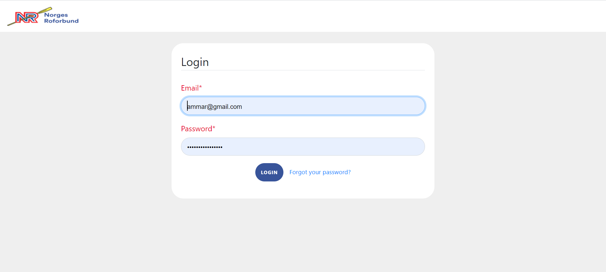

# Norges Roforbund

This is my second project in Java-Servlet. Norges Roforbund organization asked for a web application to replace their current system (Excel-sheets). There are 3 types of users:

1. Superuser: Has full control over all the clubs and trainers in Norway, can add new clubs and admins, and has some other permissions related to the database.

2. Trainer: Each club can have 1 or more admins. Admins can do everything only in their club such as adding more practitioners, registration of new test data etc.

3. Practitioner: Each club can have 1 or more practitioners. Practitioners are organized in classes, they do some tests 3 times a year, and they can see their own and other's results in the same club.

In this project I used Payara, MariaDB as containers in Docker.

## Login

## Password reset

## Password reset done

## User profile

## User details

## User create

## User list

## Testdata create

## Testdata result

## Testdata list

## Testdata result details

Enjoy!! :)

